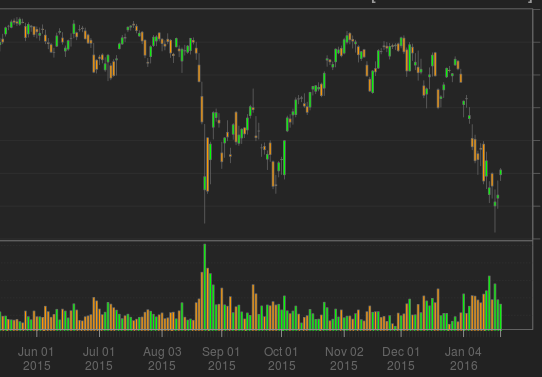
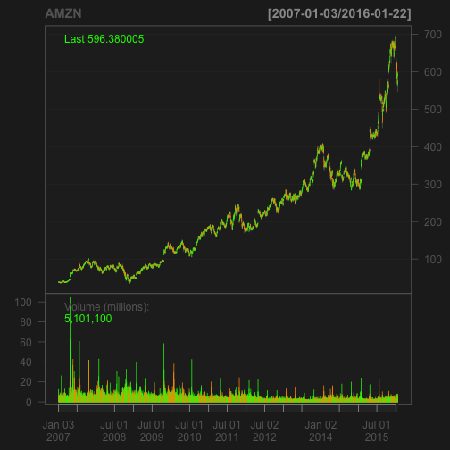
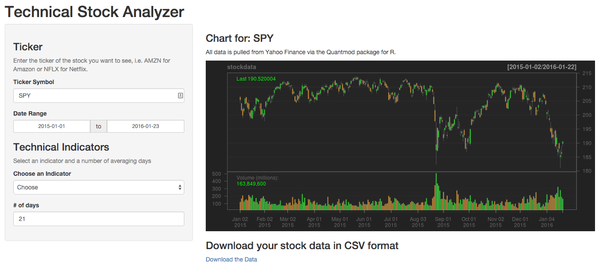

Technical Stock Analyzer
========================================================
author: CA
date: 2016-01-23
transition: rotate



Painpoint
========================================================

While there are many stock analysis portals out there, most of them cost access fees or are biased towards certain investment products or don't let users download the raw data for processing in R, Excel or other familiar tools.

*Technical Stock Analyzer* sources freely available data from [Yahoo Finance](http://finance.yahoo.com) and makes technical analysis tool available for the end user *including download functionality* -- and 

**without**

- any fees or costs
- without any bias towards any investment products


Under the Hood (1/2)
========================================================

*Technical Stock Analyzer* makes extensive use of the [Quantmod](http://www.quantmod.com/) library for R.

### Pulling Data

Stock data is pulled via the `getSymbols()` function as follows:


```r
library(quantmod)
getSymbols("AMZN")
```

```
[1] "AMZN"
```

Under the Hood (2/2)
========================================================

The data is then visualized using the `chartSeries` function and inidcators are added via the `add{Indicactor}` command.


```r
chartSeries(AMZN)
```



```r
addSMA(21) # Adding 21-day simple moving average
```


Interested?
========================================================


[**Lets fire it up!**](https://cornelalbrecht.shinyapps.io/StockAnalyzer/)


